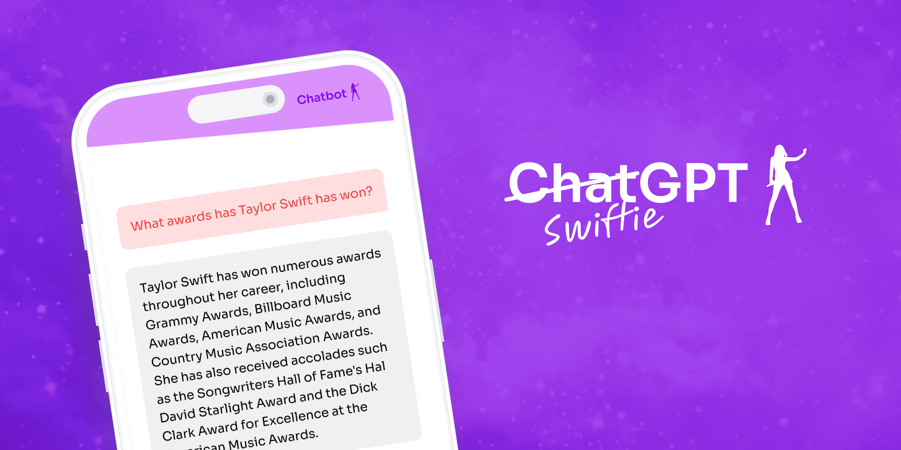

# SwiftieGPT

SwiftieGPT knows Taylor all too well. Ask questions in a clear and concise manner and get back responses based on details from publicly available data on Taylor. From tour dates to song lyrics, learn everything there is to know about the songstress here.

## Prerequisites

- An Astra DB account. You can [create one here](https://astra.datastax.com/register)
- An OpenAI account and api key [create one here](https://platform.openai.com/)

## Setup

Clone this repository to your local machine.

Install Puppeteer: `npm i puppeteer`. If you're on a newer Macbook, you'll need to run `PUPPETEER_EXPERIMENTAL_CHROMIUM_MAC_ARM=1 npm i puppeteer`.

Install the rest of the dependencies by running `npm install`.

[1Create a Vector Database](https://docs.datastax.com/en/astra/astra-db-vector/get-started/quickstart.html#create-a-serverless-vector-database) in Astra and generate and Application Token.

Copy to supplied `.env.example` to `.env` and enter your credentials for OpenAI and AstraDB:

- `OPENAI_API_KEY`: API key for OPENAI
- `ASTRA_DB_API_ENDPOINT`: Your Astra DB vector database endpoint
- `ASTRA_DB_APPLICATION_TOKEN`: The generated app token for your Astra database

## Load the data

The first thing you need to to run this chatbot is to load the data. This may take awhile, so grab some coffee! ☕️

`npx ts-node scripts/loadDb.ts`

## Running the Project

Once the data is loaded, run `npm run dev` in your terminal. Open [http://localhost:3000](http://localhost:3000) to view the chatbot in your browser.

## More Resources

- Astra DB [docs](https://docs.datastax.com/en/astra/astra-db-vector/index.html) and [quickstart](https://docs.datastax.com/en/astra/astra-db-vector/get-started/quickstart.html).
- SwiftieGPT how-to [blog post](https://www.datastax.com/blog/using-astradb-vector-to-build-taylor-swift-chatbot)

